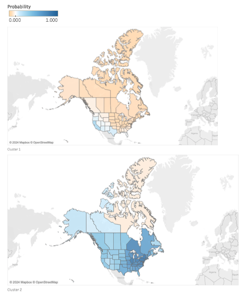

Ariel Seidman

Selected Projects in Machine Learning

[K-Means Clustering in R: Plants Data]( https://github.com/arielseidman/Plants.git)

[Sentiment Analysis in Python: Hotel Reviews Data](https://github.com/arielseidman/Hotels.git)

