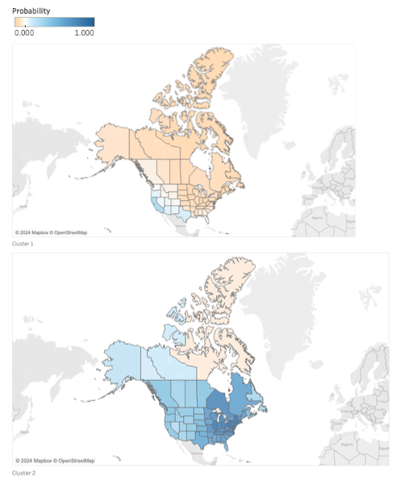
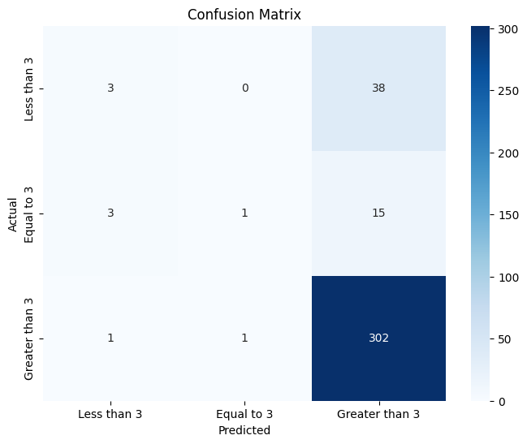

Ariel Seidman

Selected Projects in Machine Learning

<!--  Completed: -->

[K-Means Clustering (R and Tableau)]( https://github.com/arielseidman/K-Means_Clustering/blob/main/Plants_nb.md) - 2026

<!-- Under Construction / In-Progress: -->

* Performed k-means clustering in R to illustrate the relationship between the distribution of the plants and the geography
of the regions in the data set.
* Used elbow and silhouette methods to select the optimal number of clusters, then visualized clustering results using a
PCA plot, a heatmap, and Tableau choropleth maps.

[Sentiment Analysis (Python)](https://github.com/arielseidman/Sentiment_Analysis) - 2026

* Developed and deployed a multi-class logistic regression model using scikit-learn to predict hotel review ratings.
* Created comprehensive visualizations of rating distributions, feature importance, and a confusion matrix to enhance
model interpretability and communicate insights.
